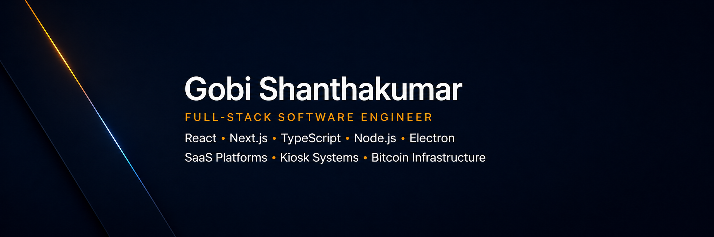

  

  <a href="https://www.linkedin.com/in/gobi-shanthakumar-1749381b1/" target="_blank">LinkedIn</a>
  •
  <a href="https://gobishanthan.dev" target="_blank">Portfolio</a>

---

## About Me

I'm a full-stack software engineer based in Ontario, Canada. I work across frontend, backend and desktop applications, with a focus on building real products from idea to production.

Most of my work has been around production systems: SaaS admin platforms, Electron kiosk applications, content management systems, payment flows, dashboards, API integrations, SDK tooling and Bitcoin-native infrastructure.

I like working on features end to end, understanding the problem, building the UI, connecting the backend, handling edge cases, debugging production issues and improving reliability.

---

## Main Skills

  

---

## What I Build

### SaaS Platforms
Admin dashboards, CMS tools, media systems, authentication flows, billing features and API integrations.

### Desktop & Kiosk Applications
Electron applications for digital signage, touchscreen systems, offline media handling, scheduling and device control.

### Backend & Infrastructure
Node.js and Express APIs, database design, authentication, third-party integrations, deployment workflows and production support.

### Bitcoin & Developer Tools
Token tooling, wallet integrations, SDKs, explorers, APIs and infrastructure for programmable assets on Bitcoin.

---

## Current Focus

- Building scalable full-stack systems
- Going deeper with TypeScript, Next.js and Node.js
- Improving deployment, CI/CD and cloud architecture
- Expanding backend system design with PostgreSQL, Redis, Docker and AWS
- Continuing work on Bitcoin-native infrastructure and developer tooling

---

## GitHub Stats

  
  

---

## Connect

  <a href="https://www.linkedin.com/in/gobi-shanthakumar-1749381b1/" target="_blank">LinkedIn</a>
  •
  <a href="https://gobishanthan.dev" target="_blank">Portfolio</a>

